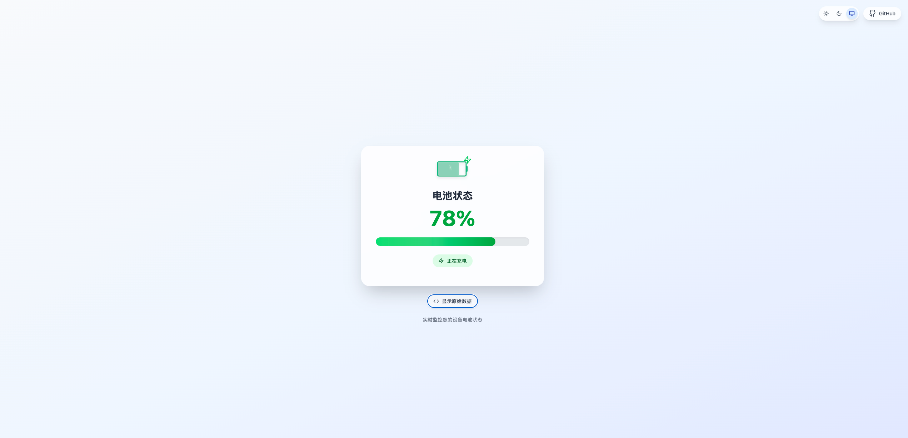
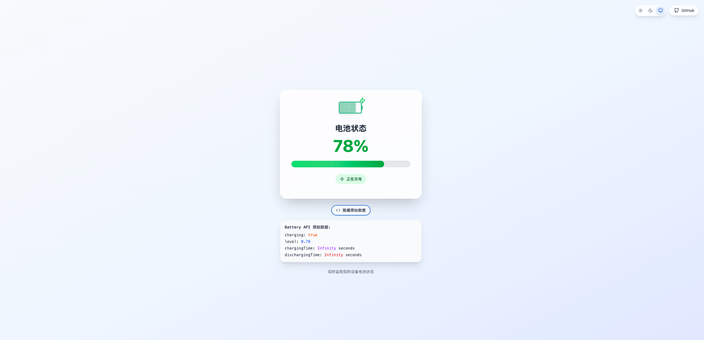

# Battery Level Monitor

一个基于 Web Battery API 的实时电池状态监控工具，使用 React + TypeScript + Tailwind CSS 构建。

## 📱 预览

### 亮色模式


### 暗色模式


### 原始数据展示


## ✨ 特性

- 📊 **实时电池监控** - 显示电池电量百分比和充电状态
- 🔋 **可视化电池图标** - 自定义 SVG 电池图标，支持充电动画
- 🎨 **主题切换** - 支持亮色/暗色/跟随系统三种主题模式
- 📱 **响应式设计** - 适配各种屏幕尺寸
- ⚡ **平滑过渡** - 主题切换时的柔和动画效果
- 🔍 **原始数据查看** - 展示 Battery API 返回的原始数据
- 💻 **现代技术栈** - React 19 + TypeScript + Tailwind CSS 4

## 🚀 快速开始

### 环境要求

- Node.js 18+
- pnpm (推荐) 或 npm

### 安装依赖

```bash
pnpm install
```

### 启动开发服务器

```bash
pnpm dev
```

### 构建生产版本

```bash
pnpm build
```

### 预览构建结果

```bash
pnpm preview
```

## 🛠️ 技术栈

- **框架**: React 19
- **语言**: TypeScript
- **样式**: Tailwind CSS 4
- **构建工具**: Vite 7
- **图标**: Lucide React
- **代码规范**: ESLint 9

## 📖 API 说明

该项目使用 [Web Battery Status API](https://developer.mozilla.org/en-US/docs/Web/API/Battery_Status_API) 获取设备电池信息：

```javascript
if ('getBattery' in navigator) {
  const battery = await navigator.getBattery();
  
  // 获取电池信息
  console.log('电池电量:', Math.round(battery.level * 100) + '%');
  console.log('是否充电:', battery.charging);
  console.log('充电时间:', battery.chargingTime);
  console.log('放电时间:', battery.dischargingTime);
}
```

### 兼容性

Battery Status API 的浏览器支持情况：

- ✅ Chrome/Chromium 浏览器
- ❌ Firefox (已移除支持)
- ❌ Safari (不支持)
- ⚠️ Edge (部分支持)

## 🎯 功能特点

### 电池状态显示

- 实时电量百分比
- 充电/未充电状态指示
- 充电时的动画效果
- 电量条可视化展示

### 主题系统

- **亮色模式**: 清新明亮的界面
- **暗色模式**: 护眼的深色主题
- **跟随系统**: 自动适应系统主题设置
- **平滑过渡**: 0.6秒的柔和切换动画

### 数据展示

- 格式化的时间显示（充电剩余时间/使用剩余时间）
- 原始 API 数据查看功能
- 实时数据更新

## 🔧 开发

### 项目结构

```
├── src/
│   ├── BatteryDisplay.tsx    # 主组件
│   ├── App.tsx              # 根组件
│   ├── main.tsx            # 入口文件
│   ├── index.css           # 全局样式
│   └── types/              # 类型定义
├── docs/                   # 文档和图片
├── public/                 # 静态资源
└── dist/                   # 构建输出
```

### 自定义样式

项目使用 Tailwind CSS 4.x 的最新特性：

- 使用 `@custom-variant` 定义暗色模式
- 全局过渡动画优化用户体验
- 响应式设计适配移动端

## 📝 许可证

MIT License - 详见 [LICENSE](LICENSE) 文件

## 🤝 贡献

欢迎提交 Issue 和 Pull Request！

## 📧 联系

如有问题或建议，请在 [GitHub Issues](https://github.com/alterem/batteryLevel/issues) 中提出。

---

⚡ 用现代 Web 技术监控你的设备电池状态！